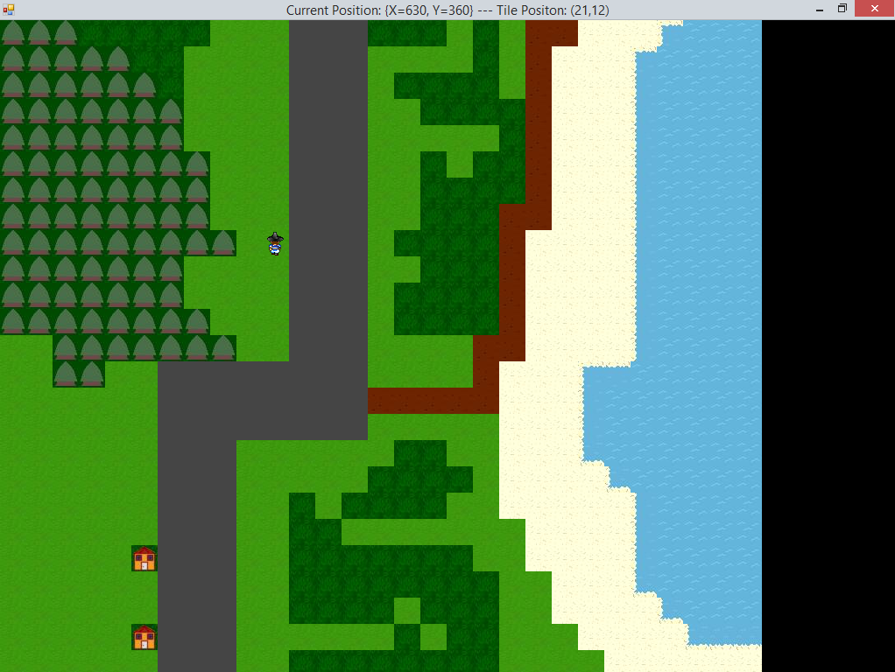
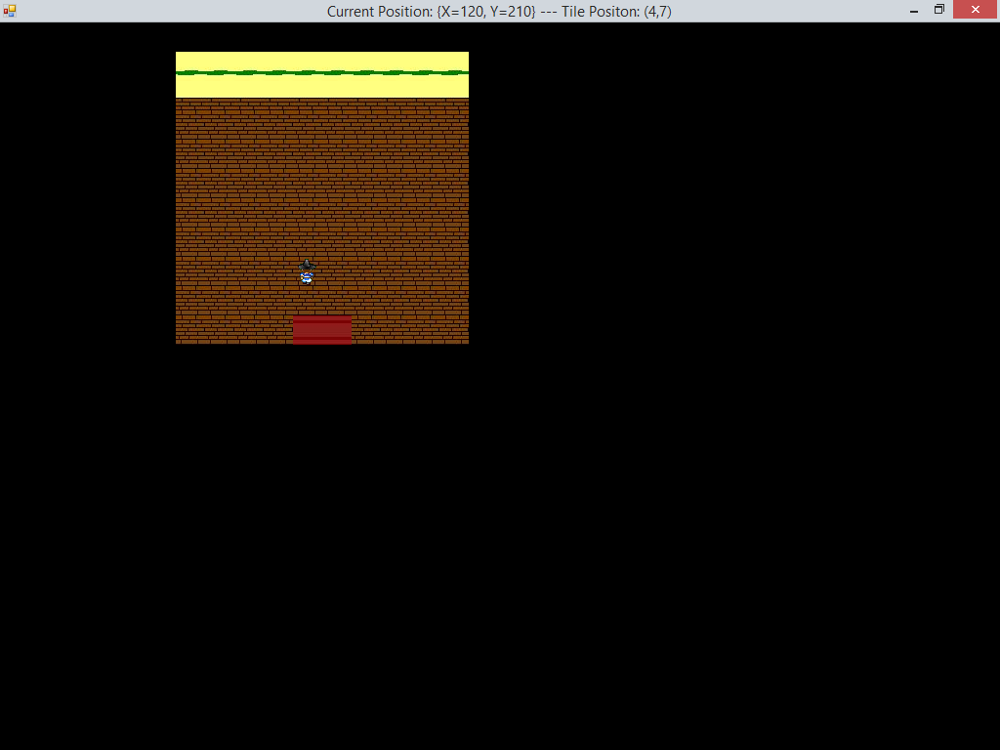
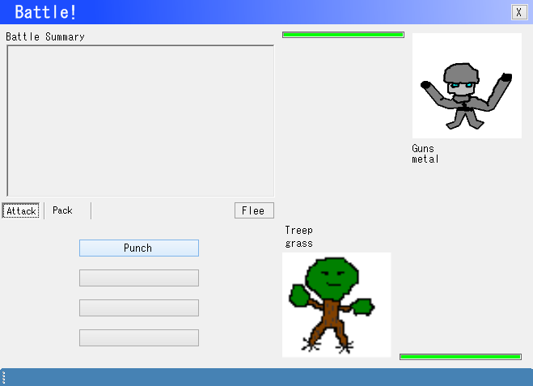

# BattleForm (aka Edjimon)
A Pokemon-style game that never made it past the alpha stage several years ago. BattleForm was just the working title as I migrated part of the original VB6 base to the new WinForms. If I remember correctly, the game started in VB6, migrated to VB.NET before I got fed up with VB and switched to CS. The project currently builds under Visual Studio 2013 Community Edition, targeting .NET 2.0, with no issues. Surprisingly, I left the code in a mostly workable from when I last touched it in 2009ish. A couple lines had to be edited in frmBattle.Designer.cs to get it to build; just a matter of variable initialization.

Here's a view of gameplay:

A view inside a house on the above screen:

The window you encounter when about to do battle:

Given the power of hindsight, I should say up-front that this is terribly-written code, smashed out by a bored college student on a dry campus late at night.

The player character sprite is from who-knows-where on the internet. This was done long before I paid close attention to licensing and those types of things. Please let me know if you know the source of the sprite so I can give credit where it is due. While I don't remember the source, I do remember explicitly choosing something that did not appear to be restricted. The "SmoothProgressBar.dll" came from Microsoft (https://support.microsoft.com/en-us/kb/323116). It's in the Release directory with the binary and referenced with an absolute path in the project.

All the other "art" was made either by me or by a friend who prefers to remain anonymous.

You can walk around one screen in the world (the game was meant to be a screen-scroller a la Pokemon Red/Yellow/Blue on the Gameboy). You are able to walk into the houses if you approach them from the front to go in the door. The rocks, trees and water tiles were all meant to be non-walkable but I never quite finished working that out.

Walk in the darker green grass to encounter wild creatures, affectionately called "edjimon". Each species has its own name, which you'll see when you battle them. In the battle, you're automatically attacked right off the bat and strikes/misses are currently handled with a MessageBox that just says "He hit you!" or "He missed you!". Your only available attack is "Punch". You can just click through until you or he loses all the HP (signified by the green progress bar) and the battle ends.

Folders:
_old - Contains multiple copy/paste backups of the code at various stages of development. The old VB code is here too. In "Old Battle! Stuff" you can also find other art, ideas for attack/move stats, world map designs and an evolution reference, among other junk.
BattleForm - The project's primary directory
Help - A CHM help file for src reference. I think it was auto-generated by NDoc but not touched since 2007 or something.
_UpgradeReport_Files - Just VS' info on upgrading from the old Visual Studio project to VS2013.
doc - NDoc source reference (last updated 2008). 

Everything else should be pretty self-explanatory and the code is quite easy to follow, though the naming convention may be a bit awkward to modern eyes.

To the maximum extent permitted by law, such as it does not conflict with any other potential licenses related to content (such as the character sprite mentioned above), this code and art is released into the Public Domain. All I ask is that you 1) Give credit and 2) Notify me if you identify the source of any items so I can give credit. I used many tutorials and online references throughout the web so if you see any major similarities to code found elsewhere, feel free to let me know so I can give credit.
